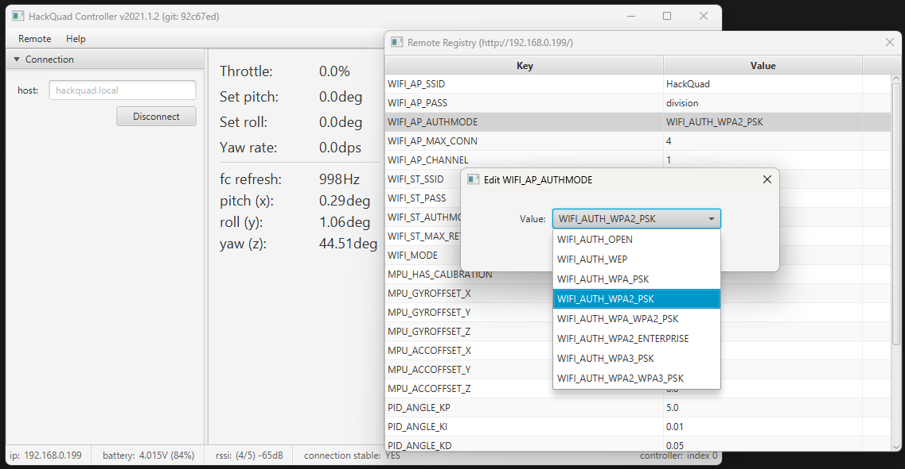

# HackQuad
An open-source esp32-based IoT quadcopter intended to be controlled over WiFi (STA or AP) via an xbox controller.

### Why
I made this in 2020, early 2021, because I like building stuff and wanted to test my mechatronics / full-stack product development 
skills. I always planned on open-sourcing it. However, after I got it flying I moved on to other projects and forgot about it.
Today I decided it's about time. I didn't have the heart to clean it up much (kinda nostalgic for me now) so its still 
very much in that dirty development stage. I did organize it for the repo though. I hope this serves as a good reference for anyone
interested in what makes a minimal quadcopter tick -- from the ground up.

### Media

#### [Flight test video](https://www.youtube.com/watch?v=RQggOqLySJw)

### Otherwise unlisted specs
|Part|Description|
|----|-----------|
|Battery|350mAh|
|Motors|8.5x20mm DC|
|Propellers|75mm D (60 works too)|
|USB-C|charging, programming & debugging|
|Frame|PLA+ here, ABS or other gummy polymer|

### Notes

#### The camera
I wired the camera connector up backwards like an idiot, but if you reverse the pin order it should work.

#### Possible improvements
Something to make this project more practical would be dropping the camera, adding a better imu w/ magnetometer, a several watt
RGB led, larger battery, maybe GPS, etc... and using the mesh networking capability of the espressif chips to make a very 
cheap drone light show platform. I say maybe GPS because dead-reckoning imu data combined w/ rssi info in a massive cluster might be
enough to get stable quad-to-quad relative positional information (saving on cost of the individual unit).

#### Improvements for this implementation
- neutral boyancy
- better IMU w/ magnometer
- proper multi-position IMU calibration routine to correct for axes skew
- linear acceleration control layer
- better battery capacity estimation
